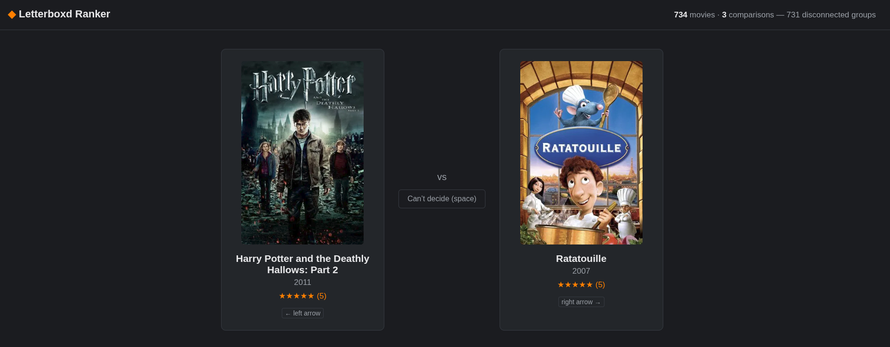

# Letterboxd Ranker



Rank your Letterboxd diary/ratings export via pairwise comparisons + a [Bradley-Terry model](https://en.wikipedia.org/wiki/Bradley%E2%80%93Terry_model) (fit with [`choix`](https://github.com/lucasmaystre/choix)), with active learning picking which pairs to ask about so you don't have to compare every possible movie combination.

## How it works

1. Export your Letterboxd data, drop `diary.csv`/`ratings.csv` into `data/`, then click "Sync from data/" in the header (or run `ingest.py` from the command line -- same code either way) to parse them into a local SQLite database.
2. `app.py` (FastAPI) serves a comparison UI at `/`: two movies, click the one you prefer (or skip).
3. Each comparison is stored. Fitting is manual: click "Refit now" (top right) whenever you want the ranking to reflect what you've compared so far.
4. `/next_pair` picks the next pair to show you, in priority order:
   - if you've locked a movie or a rating tier (see below), pick from there and ignore everything else until you unlock it;
   - otherwise, bridge disconnected parts of the comparison graph first, so the ranking stays globally meaningful;
   - early on, sample movies with the same star rating (cross-tier order is already predictable from the rating, so same-tier pairs are where a comparison is actually uncertain);
   - once a model exists, sample the pair whose predicted win probability is closest to 50/50 (max information), weighted toward under-compared movies.
   Just rewatched something and want its ranking to converge fast? Type its title into the "🔒 Lock a movie" box in the header — every pair from then on will include it, chosen by uncertainty, until you hit "Unlock".
   Want to sort out one whole star tier instead (e.g., settle the order of everything you rated 4 stars) — use the "🔒★ Lock a rating" dropdown next to it; every pair is then drawn from that tier alone, most-uncertain first.
   The two locks are mutually exclusive: picking one clears the other.
5. Movies without a rating start at the mean.
   Click "Seed from ratings" to additionally insert one *permanent* comparison for every pair of differently-rated movies (higher rating wins) — this is a real, stored comparison (`source: "rating"`), weighted identically to one of your own clicks, not a temporary nudge that fades away.
   It never touches same-rating pairs, so within-tier order (where the real uncertainty is) is always left for your own comparisons.
   Change your mind about a specific one? It's just a normal row in the Comparison history panel — reassign or delete it there like anything else.
   Safe to click again any time (e.g., after syncing newly-rated movies): it only fills in pairs that don't already have a comparison recorded -- which means re-rating a movie *after* it's already been seeded against something won't update that old comparison, since one already exists for the pair.
   Fix it the same way as a misclick: filter the Comparison history panel by that movie, delete the stale rating-derived row, then click "Seed from ratings" again.
6. `/status` shows comparison counts (yours, separate from the rating-derived count), whether the comparison graph is fully connected, a live top-20, and a Kendall-tau stability score against the previous fit so you know when the ranking has settled.
7. `/export` downloads the full ranking as CSV.
8. Misclick, or changed your mind? The "Comparison history" panel at the bottom of the page lists past comparisons and lets you reassign the winner or delete the row entirely — filter by movie (handy after a rewatch) or by source (yours vs. rating-derived).
   The list always reloads from scratch on open and after any edit, so it can't go stale if you keep comparing while it's open.
9. Nothing above refits automatically — click "Refit now" (top right) whenever you want the ranking to reflect what's changed. `/next_pair` and `/status` stay fast even with 100K+ comparisons in the table (from seeding) because the comparison graph is cached in memory and updated incrementally, not rescanned on every click; only an explicit refit pays the O(n²) fitting cost (a few seconds at ~700 movies).

## Installing the Python dependencies

This assumes the `movie-ranker` pyenv virtualenv already active in this directory (see `.python-version`).
Any Python 3.10+ environment works too.

```bash
pip3 install -r requirements.txt
```

## Downloading your Letterboxd data

[Letterboxd → Settings → Data](https://letterboxd.com/settings/data/) → Export Your Data.
Unzip it and copy `diary.csv` and/or `ratings.csv` into `data/`.
Both are supported and merged.
If a film appears in both, or has multiple diary entries (rewatches), the most recently dated entry wins.

Once the files are in `data/`, click "Sync from data/" in the header (see [Running](#running) below) -- it re-reads both files and upserts movies, no command line needed.
The command-line form still works too, and accepts explicit paths instead of `data/`:

```bash
python3 ingest.py --data-dir data/
# or explicitly:
python3 ingest.py --diary path/to/diary.csv --ratings path/to/ratings.csv
```

Re-sync (button or script) any time to add new movies or update stars/watched dates.
It upserts by (title, year), so it's safe to run repeatedly.

## Running

```bash
uvicorn app:app --reload
```

Open http://127.0.0.1:8000 and start comparing.
Left/right arrow keys pick A/B, spacebar skips ("can't decide").

## Stopping the app

If it's running in the foreground of the terminal you started it in, press Ctrl+C.

If it's in the background (started with `&`, `nohup`, or you've just lost track of which terminal it's in), find and stop it by its command line rather than guessing a PID:

```bash
pkill -f "uvicorn app:app"
```

Or see it before killing it:

```bash
pgrep -fal "uvicorn app:app"
kill <pid>
```

`--reload` runs as a supervisor process managing a separate worker process underneath it; stopping the supervisor (the PID either command above finds) shuts the worker down with it, so nothing's left running.

## Accessing from your phone (same Wi-Fi network)

Bind to all interfaces instead of just localhost:

```bash
uvicorn app:app --reload --host 0.0.0.0 --port 8000
```

Find this machine's LAN IP:

```bash
hostname -I
```

If a firewall is active on this machine (e.g., Fedora's `firewalld`), open the port for the current boot:

```bash
sudo firewall-cmd --add-port=8000/tcp
```

or permanently:

```bash
sudo firewall-cmd --add-port=8000/tcp --permanent && sudo firewall-cmd --reload
```

Then, on your phone (connected to the same Wi-Fi, not cellular), visit `http://<that-ip>:8000`.
The IP is usually DHCP-assigned and can change on reconnect; re-run `hostname -I` if the page stops loading, or set a DHCP reservation in your router for a stable address.

## Optional: posters via TMDB

Set a [TMDB API key](https://www.themoviedb.org/settings/api) (free) to show posters in the comparison UI instead of plain title cards:

```bash
export TMDB_API_KEY=your_key_here
uvicorn app:app --reload
```

Without a key set, the UI just shows title/year/rating cards.
Everything else works the same.

## Files

- `db.py` — SQLite schema (`movies`, `comparisons`, `model_runs`) + connection helper
- `ingest.py` — CSV export → SQLite; the CLI entry point, and the code `app.py`'s `/sync` route calls into
- `model.py` — Bradley-Terry fitting (via `choix`) + active-learning pair selection
- `posters.py` — optional TMDB poster lookup
- `app.py` — FastAPI server: `/`, `/status`, `/next_pair` (optionally `?locked_movie_id=` or `?locked_rating=`), `/compare`, `/comparisons` (list/edit/delete, filterable by movie and/or source), `/movies`, `/sync`, `/refit`, `/seed_rating_comparisons`, `/export`
- `static/index.html` — the comparison UI (plain HTML/JS, no build step)
